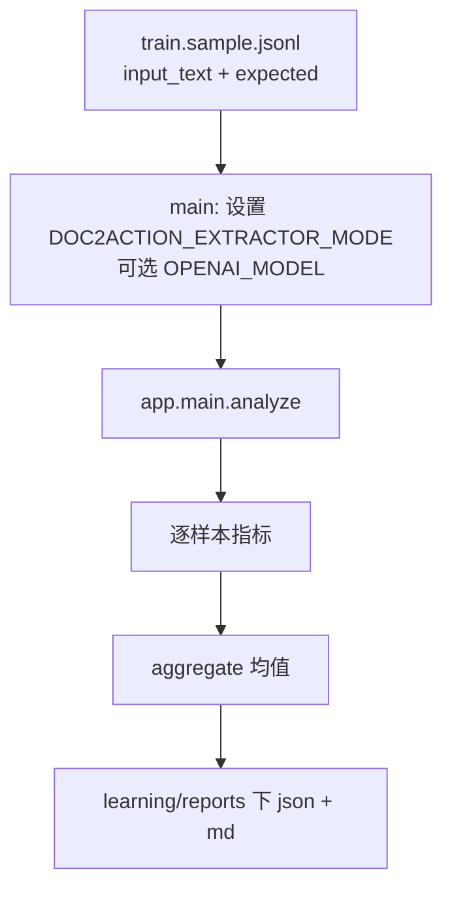
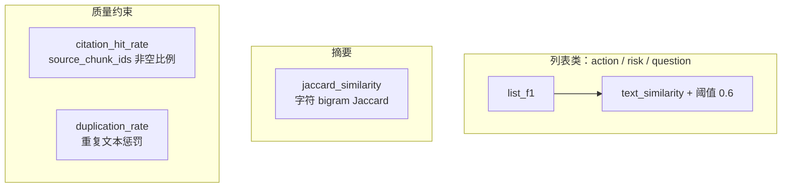

# `ml/eval/evaluate.py` 初学者讲解（流程 + 代码锚点）

> **怎么读这份笔记**：把它看成 **`main.analyze` 的离线镜像**——同一套业务函数，多了一步「与 gold 对比、出报告」。**不懂指标时先看 §1（白话 + 例子）**，再读 §3 流水线与 §4 指标树里的代码锚点。

---

## 0. 和 `main.py` 的关系（闭环一张图）



要点：**不是另写一套抽取逻辑**，而是 `sys.path` 引入 `backend` 后直接调 `analyze`（与线上一致）。

```12:17:ml/eval/evaluate.py
ROOT = Path(__file__).resolve().parents[2]
BACKEND_DIR = ROOT / "backend"
if str(BACKEND_DIR) not in sys.path:
    sys.path.insert(0, str(BACKEND_DIR))

from app.main import AnalyzeRequest, analyze  # noqa: E402
```

---

## 1. 评估的意义与整条逻辑（白话 + 数字例子）

> 复习时优先读本节：**先建立「改卷子」直觉**，再看 §4 里 `list_f1` 与代码。

### 1.1 评估到底在评什么？

`analyze` 读文档、吐出待办/风险/问题/摘要。**评估**只回答一句话：**吐出来的东西和标准答案（数据里的 `expected`）差多少？**

- **有意义**：改 prompt、换规则、换模式之后，分数能对比，不是凭感觉。
- **没有评估**：只能说「好像更好」，面试/报告也说不清。

### 1.2 整条逻辑（像老师改卷）

1. 每一行 `jsonl` = 一道题：有 `input_text`，也有参考答案 `expected`。  
2. 同一篇输入交给 `analyze`，得到 **学生答卷** `prediction`。  
3. **待办 / 风险 / 开放问题**：都是「一条条句子」组成的列表 → 要比的是 **预测列表和标准答案列表有没有对上号**（不要求第 1 条一定对第 1 条，顺序可以乱、说法可以略不同）。  
4. **摘要**：一大段话，用「整段像不像」来比。  
5. 每道题打分，再在很多题上 **取平均** → 报告里的 `action_f1`、风险 F1 等。

```text
标准答案(expected)     模型输出(prediction)
        \                   /
         \                 /
          ------ 对比打分 ------
                   |
     action/risk/question 的 F1，摘要相似度，
     引用率、重复率、used_llm_rate
                   |
              汇总报告
```

### 1.3 列表类指标为啥不「第 i 条对第 i 条」？

模型 **不保证顺序** 和 `expected` 一致，措辞也会略变。若死板按位置比，**明明说对了但换行**也会被算错。  
所以脚本做法是：**每条预测**去标准答案里找 **最像且还没被用过** 的一条；**够像**（`text_similarity ≥ 0.6`）算 **命中一对**，再数命中个数算 precision/recall/F1。  
（「有多像」由 `text_similarity` 算；可先当成黑盒：**0～1 的相似分**。）

### 1.4 其它指标一句话

- **`summary_jaccard`**：摘要整段和参考答案 **字面上重叠多不多**（不强迫一字不差）。  
- **`citation_hit_rate`**：每条结构里有没有填 `source_chunk_ids`（**有没有指回原文证据**）。  
- **`duplication_rate`**：待办/风险/问题文案是否 **重复堆条**（防灌水）。  
- **`used_llm_rate`**：这批样本里多少趟真正拿到了 LLM 的 dict（**成本/稳定性**）。

### 1.5 数字例子：`list_f1` 在干什么（不手算 bigram）

下面例子为说明「配对 + 命中数」；其中 **短句被长句包含** 时，代码里 `text_similarity` 会得 **1.0**（≥ 0.6，算命中）。

**例子 A——两条都对上（F1 = 1）**

- gold：`本周完成需求评审`，`发邮件同步结论`  
- pred：`完成需求评审`（被第一条包含 → 1.0），`发邮件同步结论`（与第二条一致 → 1.0）  
→ 命中 2 对，pred 共 2、gold 共 2 → precision = recall = 1，**F1 = 1**。

**例子 B——只对一半（F1 = 0.5）**

- gold：`准备周会材料`，`联系客户确认时间`  
- pred：`准备周会材料`（命中第一条），`完全不相干的一句话`（与第二条不够像 → **不命中**）  
→ 命中 1 对 → precision = 1/2，recall = 1/2，**F1 = 0.5**。

**例子 C——顺序打乱仍能全对**

- gold：`先写方案`，`再评审`  
- pred：`再评审`，`先写方案`  
→ 第 1 条 pred 先去蹭 gold 里最像的 `再评审`；第 2 条再蹭 `先写方案` → 仍 **2 对 2**，**F1 仍可 = 1**。说明评估看的是 **「能否在答案池里找到够像的一条」**，不是死板对行号。

---

## 2. 场景：跑一轮离线基线

**输入**：`ml/data/train.sample.jsonl`（每行一个样本：`input_text`、`expected` 等）。  
**输出**：`learning/reports/{report_prefix}.json` + `.md`，含 **汇总均值** 与 **逐样本行**。

**启动时先写环境变量**（决定本次评估走哪条抽取策略）：

```238:251:ml/eval/evaluate.py
def main() -> None:
    args = parse_args()
    os.environ["DOC2ACTION_EXTRACTOR_MODE"] = args.extractor_mode
    if args.openai_model:
        os.environ["OPENAI_MODEL"] = args.openai_model

    result = run_evaluation(args.data_path)
    write_reports(
        result=result,
        data_path=args.data_path,
        report_prefix=args.report_prefix,
        extractor_mode=args.extractor_mode,
        openai_model=args.openai_model,
    )
    print("Baseline evaluation completed.")
```

---

## 3. 单样本流水线（核心循环）

顺序：**读样本 → `analyze` → 从预测里抽字符串列表 → 与 `expected` 算分 → 记录 `used_llm` → 汇总**。

```133:184:ml/eval/evaluate.py
    for sample in samples:
        prediction = analyze(
            AnalyzeRequest(
                text=sample["input_text"],
                document_type=sample.get("document_type", "general"),
            )
        ).model_dump()
        used_llm_flags.append(bool(prediction.get("meta", {}).get("used_llm")))

        pred_actions = [item["title"] for item in prediction["action_items"]]
        pred_risks = [item["description"] for item in prediction["risks"]]
        pred_questions = [item["question"] for item in prediction["open_questions"]]

        gold_actions = sample["expected"]["action_items"]
        gold_risks = sample["expected"]["risks"]
        gold_questions = sample["expected"]["open_questions"]

        action_metrics = list_f1(pred_actions, gold_actions)
        risk_metrics = list_f1(pred_risks, gold_risks)
        question_metrics = list_f1(pred_questions, gold_questions)
        summary_sim = jaccard_similarity(prediction["summary"], sample["expected"]["summary"])

        citation_items = prediction["action_items"] + prediction["risks"] + prediction["open_questions"]
        if citation_items:
            citation_hit = sum(1 for item in citation_items if item.get("source_chunk_ids")) / len(citation_items)
        else:
            citation_hit = 1.0

        all_texts = [*pred_actions, *pred_risks, *pred_questions]
        deduped_size = len({normalize_text(text) for text in all_texts if normalize_text(text)})
        duplication_rate = 0.0 if not all_texts else 1 - (deduped_size / len(all_texts))
```

**和 `main.py` 对齐的记忆点**：

- `used_llm_rate` ← 每条样本的 `meta.used_llm`（与 `main` 里 `bool(llm_payload)` 一致）。
- gold 里 `action_items` 等是 **字符串列表**；预测侧从结构化字段里 **取出 title/description/question** 再比。

---

## 4. 指标树（记「算什么」+「代码在哪」）



### 4.1 近似匹配 F1（为何不用完全字符串相等）

- `list_f1`：预测项与 gold 项 **贪心最佳匹配**，`text_similarity >= 0.6` 算命中一对。
- `text_similarity`：归一化 + 子串包含得 1.0，否则用 **字符 bigram 的 Jaccard 式重叠**（与 `jaccard_similarity` 共用 `char_ngrams` 思想）。

```65:97:ml/eval/evaluate.py
def list_f1(pred: list[str], gold: list[str], match_threshold: float = 0.6) -> dict[str, float]:
    pred_list = [normalize_text(item) for item in pred if normalize_text(item)]
    gold_list = [normalize_text(item) for item in gold if normalize_text(item)]
    # ... 双集合匹配 ...
        if best_gi is not None and best_score >= match_threshold:
            matched_pred.add(pi)
            matched_gold.add(best_gi)
    # ... precision / recall / f1 ...
```

```47:62:ml/eval/evaluate.py
def text_similarity(a: str, b: str) -> float:
    a_norm = normalize_text(a)
    b_norm = normalize_text(b)
    # ...
    if a_norm in b_norm or b_norm in a_norm:
        return 1.0
    grams_a = char_ngrams(a_norm, 2)
    grams_b = char_ngrams(b_norm, 2)
    union = grams_a | grams_b
    if not union:
        return 0.0
    return len(grams_a & grams_b) / len(union)
```

### 4.2 `summary_jaccard`

- 对 **摘要整段** 做 `jaccard_similarity`（预测 `summary` vs `expected.summary`）。

```100:108:ml/eval/evaluate.py
def jaccard_similarity(a: str, b: str) -> float:
    grams_a = char_ngrams(a, 2)
    grams_b = char_ngrams(b, 2)
    # ...
    return len(grams_a & grams_b) / len(union)
```

### 4.3 `citation_hit_rate`（条目级）

- 在 **所有 action/risk/question 条目** 上，统计 `source_chunk_ids` **真值非空**的比例。
- **若没有任一条目**（空列表），定义为 **1.0**（避免除零；语义是「无可评引用」）。

（见第 3 节循环内 `citation_items` / `citation_hit` 代码块。）

### 4.4 `duplication_rate`

- 把三类预测文本拼在一起，**去重后条数 / 总条数**，再用 `1 - 比值` 作为重复率。

（见第 3 节 `all_texts` / `deduped_size` / `duplication_rate` 代码块。）

### 4.5 汇总

```186:195:ml/eval/evaluate.py
    aggregate = {
        "sample_count": len(samples),
        "action_f1": round(mean(action_f1_scores), 4),
        "risk_f1": round(mean(risk_f1_scores), 4),
        "question_f1": round(mean(question_f1_scores), 4),
        "summary_jaccard": round(mean(summary_scores), 4),
        "citation_hit_rate": round(mean(citation_hit_rates), 4),
        "duplication_rate": round(mean(duplication_rates), 4),
        "used_llm_rate": round(sum(1 for x in used_llm_flags if x) / len(used_llm_flags), 4) if used_llm_flags else 0.0,
    }
```

---

## 5. 报告写出（给人看 + 给机器读）

```200:235:ml/eval/evaluate.py
def write_reports(result: dict[str, Any], data_path: Path, report_prefix: str, extractor_mode: str, openai_model: str) -> None:
    REPORT_DIR.mkdir(parents=True, exist_ok=True)
    json_path = REPORT_DIR / f"{report_prefix}.json"
    md_path = REPORT_DIR / f"{report_prefix}.md"
    json_path.write_text(json.dumps(result, ensure_ascii=False, indent=2), encoding="utf-8")
    # ... md 拼接 aggregate + per_sample 摘要行 ...
```

---

## 6. 答题模板（面试 30 秒）

> 离线评估直接调用 **`analyze`**，用 **`DOC2ACTION_EXTRACTOR_MODE`** 在同一数据集上对比策略。  
> **action/risk/question** 用 **近似匹配 F1**，**summary** 用 **字符 bigram Jaccard**；另看 **引用命中率** 与 **重复率**，并统计 **`used_llm_rate`** 对齐成本与稳定性。

---

## 7. 自测清单（不写长答案，自己口述）

- 为什么说评估链路调的是 **`main` 真函数** 而不是抄一套逻辑？  
- `citation_hit_rate` 在 **「没有任何条目」** 时为什么是 **1.0**？  
- `action_f1` 升、`duplication_rate` 也升时，你怎么解释「质量换分数」？
