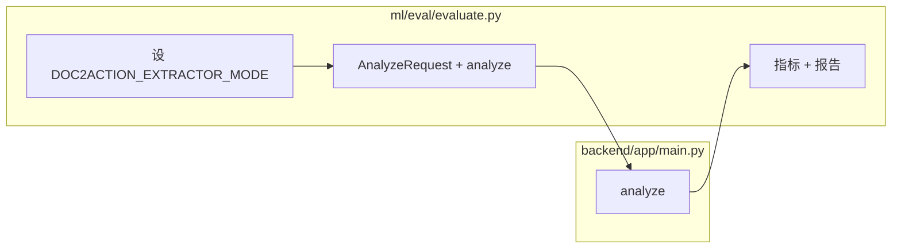
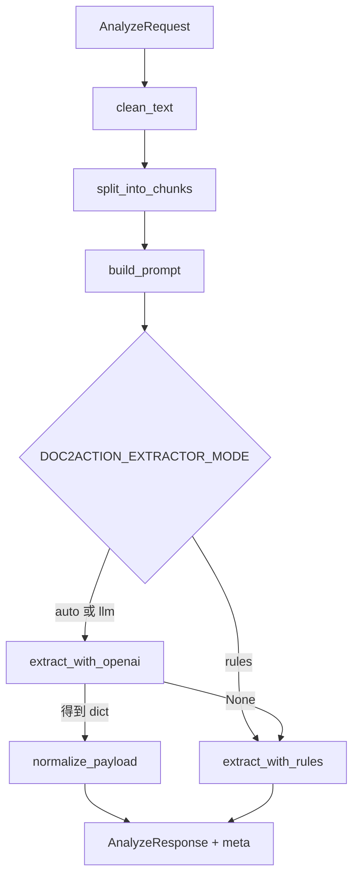
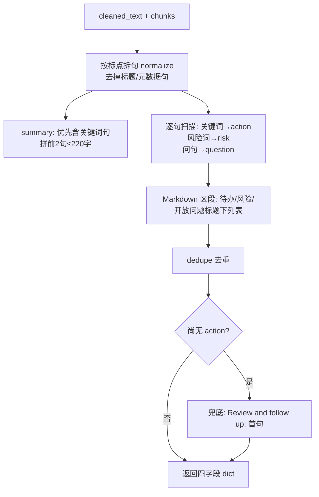

# `backend/app/main.py` 初学者讲解（流程 + 代码锚点）

> **怎么读这份笔记**：先顺着 **场景 → 流程图 → 要点**，再点进 **代码引用** 对照。目标是建立一棵「主干清晰、分支有据」的树，而不是散点背诵。  
> 文中 **「复习：…」** 小节来自学习过程中的提问与整理，复习时可优先扫这些块。

---

## 0. 在系统里的位置（和 `evaluate.py` 怎么闭合）

- **`main.py`**：线上/库内 **唯一编排入口**——`analyze()` 把「清洗 → 切块 → 抽取 → 统一响应」收口。
- **`evaluate.py`**：离线批跑 **同一套 `analyze()`**，用 gold 算指标；通过环境变量切换 `rules|auto|llm` 做公平对比。



---

## 1. 场景：用户发一次「分析文档」

**输入**：一段长文本 + 文档类型。  
**输出**：摘要、待办、风险、开放问题 + **可点击的证据块 `chunks`** + **复盘用 `meta`**。

---

## 2. 数据契约（Schema）：先定「能进什么、出什么」

要点：

- 请求：**`text` 必填非空**；`document_type` 有默认。
- 响应：固定字段 + 嵌套模型（`ActionItem` 等），便于 FastAPI 校验与前端稳定解析。
- `source_chunk_ids`：**只保证是 `list[int]`**，不校验 id 是否落在本次 `chunks` 里（越界 id 仍可能通过校验，前端需容错）。

```44:77:backend/app/main.py
class AnalyzeRequest(BaseModel):
    text: str = Field(..., min_length=1)
    document_type: str = "general"


class Chunk(BaseModel):
    id: int
    text: str


class ActionItem(BaseModel):
    title: str
    priority: str = "medium"
    source_chunk_ids: list[int] = Field(default_factory=list)


class RiskItem(BaseModel):
    description: str
    severity: str = "medium"
    source_chunk_ids: list[int] = Field(default_factory=list)


class OpenQuestion(BaseModel):
    question: str
    source_chunk_ids: list[int] = Field(default_factory=list)


class AnalyzeResponse(BaseModel):
    summary: str
    action_items: list[ActionItem]
    risks: list[RiskItem]
    open_questions: list[OpenQuestion]
    chunks: list[Chunk]
    meta: dict[str, Any]
```

### 复习：`Field` 和 `Field(default_factory=list)` 是啥？有啥用？

- **`Field`**：Pydantic 提供的函数，用来给字段加 **校验规则**（如 `min_length`）和 **默认值行为**，不只是写 `x: str = "abc"` 这种简单默认。
- **`Field(default_factory=list)`**：表示「没传 `source_chunk_ids` 时，调用 **`list()` 新建一个空列表**」。
- **为啥不用 `default=[]`？** 在 Python 里可变默认值（同一个 `[]`）会被所有实例共享，容易出隐蔽 bug；`default_factory=list` 保证 **每个实例各自一份** 空列表。

---

## 3. 主干流程（与代码一致）

**顺序记忆**：`clean_text` → `split_into_chunks` → `build_prompt` → 按 `DOC2ACTION_EXTRACTOR_MODE` 决定 **是否调 LLM**、**最终 payload 来自哪** → 组装 `AnalyzeResponse`。



**代码锚点（编排全在这里）**：

```363:395:backend/app/main.py
@app.post("/analyze", response_model=AnalyzeResponse)
def analyze(request: AnalyzeRequest) -> AnalyzeResponse:
    cleaned_text = clean_text(request.text)
    chunks = split_into_chunks(cleaned_text)
    prompt = build_prompt(request.document_type, chunks)

    extractor_mode = os.getenv("DOC2ACTION_EXTRACTOR_MODE", "auto").strip().lower()
    if extractor_mode not in {"auto", "rules", "llm"}:
        extractor_mode = "auto"

    llm_payload: dict[str, Any] | None = None
    if extractor_mode in {"auto", "llm"}:
        llm_payload = extract_with_openai(prompt)

    if extractor_mode == "rules":
        parsed_payload = extract_with_rules(cleaned_text, chunks)
    else:
        parsed_payload = normalize_payload(llm_payload) if llm_payload else extract_with_rules(cleaned_text, chunks)

    return AnalyzeResponse(
        summary=parsed_payload["summary"],
        action_items=parsed_payload["action_items"],
        risks=parsed_payload["risks"],
        open_questions=parsed_payload["open_questions"],
        chunks=chunks,
        meta={
            "document_type": request.document_type,
            "chunk_count": len(chunks),
            "used_llm": bool(llm_payload),
            "extractor_mode": extractor_mode,
            "llm_fallback": extractor_mode in {"auto", "llm"} and not bool(llm_payload),
        },
    )
```

---

## 4. 分支 A：文本预处理 + 切块（可追溯的基础）

| 步骤 | 作用（面试一句话） |
|------|-------------------|
| `clean_text` | 去空行、行首行尾空白，文本形状稳定，后面按段切分不飘。 |
| `split_into_chunks` | 按段合并到 `max_chars`，生成带 `id` 的 `Chunk`，供 prompt 与引用。 |

```80:109:backend/app/main.py
def clean_text(raw_text: str) -> str:
    lines = [line.strip() for line in raw_text.splitlines()]
    non_empty = [line for line in lines if line]
    return "\n".join(non_empty)


def split_into_chunks(text: str, max_chars: int = 500) -> list[Chunk]:
    paragraphs = [p.strip() for p in text.split("\n") if p.strip()]
    chunks: list[Chunk] = []
    current = ""

    for para in paragraphs:
        if not current:
            current = para
            continue

        candidate = f"{current}\n{para}"
        if len(candidate) <= max_chars:
            current = candidate
        else:
            chunks.append(Chunk(id=len(chunks) + 1, text=current))
            current = para

    if current:
        chunks.append(Chunk(id=len(chunks) + 1, text=current))

    if not chunks:
        chunks.append(Chunk(id=1, text=text))

    return chunks
```

### 复习：`if current:` 和 `if not chunks:` 有啥区别？

- **`if current:`**（循环结束后）：`for` 里只有在「当前块装不下下一段」时才会 `append` 一块；**最后往往还剩一段**一直堆在 `current` 里没 flush。这里把 **缓冲区里剩下的正文** 打成 **最后一个正常 chunk**。
- **`if not chunks:`**（兜底）：若跑完上面逻辑后 **`chunks` 仍是空列表**（例如按行拆完没有任何非空段落，`for` 从未向 `chunks` 追加），就 **强行追加一块** `Chunk(id=1, text=text)`，用 **函数入参的整段 `text`**，避免后面 `chunks == []` 让 prompt/分析链路难处理。
- **一般只会命中其一**：第一段执行后若已有 chunk，第二段的 `not chunks` 就为假。

---

## 5. 分支 B：`build_prompt`（把 chunk 编号写进上下文）

要点：

- 正文前加 **`[chunk_{id}]`**，与响应里的 `chunks[].id`、`source_chunk_ids` **同一套编号**。
- Prompt 里写死 **期望 JSON 形状**，约束模型输出字段名（但仍可能错字段名，见 `normalize_payload` 一节）。

```118:135:backend/app/main.py
def build_prompt(document_type: str, chunks: list[Chunk]) -> str:
    chunk_text = "\n\n".join([f"[chunk_{c.id}]\n{c.text}" for c in chunks])
    return (
        "You are an assistant for converting unstructured documents into executable outputs.\n"
        f"Document type: {document_type}\n\n"
        "Return a valid JSON object with this exact shape:\n"
        "{\n"
        '  "summary": "string",\n'
        '  "action_items": [{"title":"string","priority":"high|medium|low","source_chunk_ids":[1]}],\n'
        '  "risks": [{"description":"string","severity":"high|medium|low","source_chunk_ids":[1]}],\n'
        '  "open_questions": [{"question":"string","source_chunk_ids":[1]}]\n'
        "}\n\n"
        "Rules:\n"
        "- Use only information grounded in chunks.\n"
        "- Keep action_items concise and executable.\n"
        "- Do not invent owners or due dates unless explicit.\n\n"
        f"Chunks:\n{chunk_text}"
    )
```

---

## 5.5 分支：`extract_with_rules`（规则抽取 / LLM 回退时同一套）

**场景**：`extractor_mode == "rules"`，或 `auto`/`llm` 下 `llm_payload` 为 `None`。不调用大模型，**仅在本地**从 `cleaned_text` + `chunks` 拼出与 `normalize_payload` **相同形状**的四件套。

### 流程（先建立主干）



### 要点（面试够用版）

| 模块 | 做什么 |
|------|--------|
| **拆句** | 用 `[。！？!?;\n]` 切开，再 `normalize_sentence`；`is_metadata_or_heading` 过滤像「会议结论」「日期：」等。 |
| **summary** | 优先选含「结论、目标、需要…」等且不像问句的句；否则用全部内容句；**最多两句、总长 ≤220**，用 `；` 连接。 |
| **action** | 句子里命中 **action 关键词**（含中英如 `需要、请、完成、must`）且 **不像问句** → 记入 `action_items`，`chunk_ids_for_sentence` 填引用。 |
| **risk** | 命中 **risk 关键词**（如 `风险、阻塞、delay`）→ `risks`。 |
| **open_questions** | 含 `?`、`？` 或 **`是否`** → `open_questions`。 |
| **Markdown 加分** | `extract_markdown_section_items`：在「待办事项 / 操作步骤」「风险」「待确认问题 / 开放问题」等 **Markdown 小节标题**下抽列表项，**追加**到对应列表（每类最多 6 条）。**纯一段式 SOP**（如 train-004）**没有这些小节**，主要靠 **关键词 + 问句** 分支。 |
| **去重** | `dedupe_dict_items` 按 `title` / `description` / `question` 去近似重复。 |
| **action 兜底** | 若做完仍 **没有任何 action** 且 **有内容句**，则塞一条 **`Review and follow up: {第一句}`**——评估里常表现为 **条数、措辞与 gold 差很远 → `action_f1` 低**。 |

### 代码锚点（全文）

```218:326:backend/app/main.py
def extract_with_rules(cleaned_text: str, chunks: list[Chunk]) -> dict[str, Any]:
    sentence_candidates = re.split(r"[。！？!?;\n]", cleaned_text)
    sentences = [normalize_sentence(s) for s in sentence_candidates if normalize_sentence(s)]
    content_sentences = [s for s in sentences if not is_metadata_or_heading(s)]
    # ... summary_pool 与 summary ...
    action_keywords = ["todo", "action", "need", "must", "should", "需要", "请", "跟进", "完成"]
    risk_keywords = ["risk", "blocker", "dependency", "delay", "风险", "阻塞", "依赖", "延期"]
    # ... 逐句填 action / risks / open_questions ...
    section_action_items = extract_markdown_section_items(cleaned_text, ["待办事项", "操作步骤"])
    section_risk_items = extract_markdown_section_items(cleaned_text, ["风险"])
    section_question_items = extract_markdown_section_items(cleaned_text, ["待确认问题", "开放问题"])
    # ... merge section_* 进列表，dedupe ...
    if not action_items and content_sentences:
        fallback = content_sentences[0]
        action_items.append(
            {
                "title": f"Review and follow up: {fallback}",
                # ...
            }
        )

    return {
        "summary": summary or "No summary generated.",
        "action_items": action_items,
        "risks": risks,
        "open_questions": open_questions,
    }
```

### 复习：和 `evaluate.py` 里某条样本为啥对不上？

- **纯段落、无 Markdown 小节**：rules **吃不到**「待办事项」区段加成，全靠 **关键词**；gold 写得简练（如「重复投诉超过2次时升级主管」）而模型抽出来带 **整句+兜底前缀**，容易 **`text_similarity < 0.6`** → **F1 为 0**。  
- **风险句** 多了「风险是…」「会/可能」用语不同，也可能 **略低于 0.6**。  
- **带「是否」的问句** 走 **开放问题**，和 gold 字面一致时 **`question_f1` 仍可 1.0**。

---

## 6. 分支 C：LLM 抽取（成功/失败如何定义）

要点：

- **`extract_with_openai` 返回 `None`**：无 key、客户端不可用、请求异常、`json.loads` 失败等 → **上层走 rules**。
- **`used_llm`**：`bool(llm_payload)` → 只表示「拿到了解析后的 dict」，**不表示** 业务字段一定填满或 schema 完美（甚至 `{}` 也会 `used_llm=True`）。
- **`normalize_payload`**：只取四个顶层键，缺失给默认；**不做字段名纠错、不校验嵌套项是否合法**。

```329:360:backend/app/main.py
def extract_with_openai(prompt: str) -> dict[str, Any] | None:
    api_key = os.getenv("OPENAI_API_KEY")
    if not api_key or OpenAI is None:
        return None
    # ...
    try:
        response = client.chat.completions.create(
            model=model,
            temperature=0.2,
            response_format={"type": "json_object"},
            messages=[
                {"role": "system", "content": "You produce grounded structured JSON only."},
                {"role": "user", "content": prompt},
            ],
        )
        raw = response.choices[0].message.content or "{}"
        return json.loads(raw)
    except Exception:
        return None


def normalize_payload(payload: dict[str, Any]) -> dict[str, Any]:
    return {
        "summary": payload.get("summary") or "No summary generated.",
        "action_items": payload.get("action_items") or [],
        "risks": payload.get("risks") or [],
        "open_questions": payload.get("open_questions") or [],
    }
```

### 复习：`normalize_payload(llm_payload)` 是什么意思？有啥用？

- **`llm_payload`**：`extract_with_openai` **成功**时返回的 dict（已对模型返回字符串做过 `json.loads`）。
- **`normalize_payload(llm_payload)`**：只取出 **`summary` / `action_items` / `risks` / `open_questions`** 四个顶层键；缺的用默认（摘要用占位句，列表用 `[]`），避免后面 `parsed_payload["summary"]` 等 **KeyError**。
- **不做的事**：**不纠正字段名**（例如模型写 `actions` 而不是 `action_items`，这里照样拿不到，会变成 `[]`）；也 **不校验** 列表里每条是否含 `title` 等（那是 `AnalyzeResponse` 构造时 Pydantic 的事）。
- **何时调用**：仅在 `analyze` 里 **`llm_payload` 非 `None`** 时：`normalize_payload(llm_payload)`；若为 `None` 则走 `extract_with_rules`，**不会**调用 `normalize_payload`。

---

## 7. `meta` 速查（复盘 / 对齐 `evaluate.py`）

| 字段 | 含义 |
|------|------|
| `used_llm` | 本次是否得到非 `None` 的 `llm_payload`（与 `evaluate` 里 `used_llm_rate` 同源）。 |
| `llm_fallback` | `auto`/`llm` 下未拿到 `llm_payload` 时为 `True`，表示实际 body 来自 rules。 |
| `extractor_mode` / `chunk_count` / `document_type` | 实验记录与成本/长度感知。 |

（定义见上一节 `AnalyzeResponse(..., meta={...})` 代码块。）

### 复习：`llm_fallback` 那句话到底啥意思？（和 `used_llm` 对照）

代码：`"llm_fallback": extractor_mode in {"auto", "llm"} and not bool(llm_payload)`。

- **「auto / llm 下未拿到 `llm_payload`」**：配置是 **`auto` 或 `llm`**（本来会去调 `extract_with_openai`），但 **`llm_payload` 为 `None`**（无 key、网络/解析失败等）。
- **「实际 body 来自 rules」**：此时 `parsed_payload` 只能走  
  `extract_with_rules(cleaned_text, chunks)`，即 **`summary` / `action_items` / `risks` / `open_questions` 四块内容来自规则抽取**，不是 LLM 的 `normalize_payload` 结果。
- **和 `used_llm` 对比**：`used_llm = bool(llm_payload)`，有 dict 才为 `True`；**`llm_fallback=True` 时一定有 `used_llm=False`**（因为没拿到 `llm_payload`）。  
  一句话：**`llm_fallback` =「名义上要上 LLM，没成，最后其实是 rules 填的响应体」。**

---

## 8. 双策略的工程动机（面试 3 句话）

1. **可用性**：LLM 失败仍有 rules，接口不依赖「模型永远在线」。  
2. **可评估**：同一 `analyze()`，换环境变量即可对比策略（由 `evaluate.py` 执行）。  
3. **可解释**：返回 `chunks` + 条目上 `source_chunk_ids`，支撑人工核对与引用展示。

---

## 9. 5 分钟自测（过关标准）

- 能不看代码画出：`clean → chunk → prompt → mode → payload 来源 → response`。  
- 能口述 `rules` / `auto` / `llm` 下 **是否调用** `extract_with_openai`，以及 `used_llm` 与 `llm_fallback` 的典型取值。  
- 能说明：`chunks` 与 `source_chunk_ids` 为何要**同时**存在。
